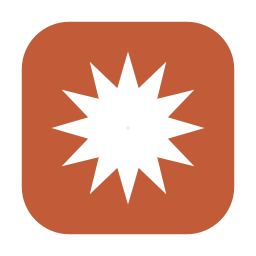

<p align="center">
  
</p>

# Claude Usage Bar

A tiny macOS menu bar app that shows your Claude Code usage as `</> NN%`. Click it
for the full breakdown (session, weekly, per model) with reset times.

## Install

> [!TIP]
> **Paste the prompt below into Claude Code.** It builds the app, drops it in your
> menu bar, and starts it at login. Nothing else to set up.

```text
Install the menu bar app from https://github.com/atreyabhat/claude-usage-bar: clone it and run scripts/install.sh, which builds it from source, puts it in my menu bar, and starts it at login. It reads my existing Claude Code login. Then confirm it is running.
```

Requires macOS 13+ and the Xcode Command Line Tools (`xcode-select --install`).
To remove it later, tell Claude Code to run `scripts/uninstall.sh`.

It runs locally and read only, calling the same usage endpoint Claude Code's
`/usage` view uses (undocumented, so it could change).


## Stats for Nerds

- **Exact reset times.** Claude Code's `/usage` shows the reset only in whole hours (2h 45m reads as "2 hours"); this counts down to the exact minute.
- **Fresh on demand.** Polls every 60 seconds, and refetches the moment you open the dropdown, so a manual check is always current.
- **Real numbers.** Reads the same endpoint `/usage` uses, so the percentages are authoritative, not estimated from local logs.
- **All limits at once.** Session (5hr), weekly, and the per-model weekly, each with its own reset countdown.
- **Featherweight.** About 0% CPU when idle, ~15 MB memory, one small request a minute.
